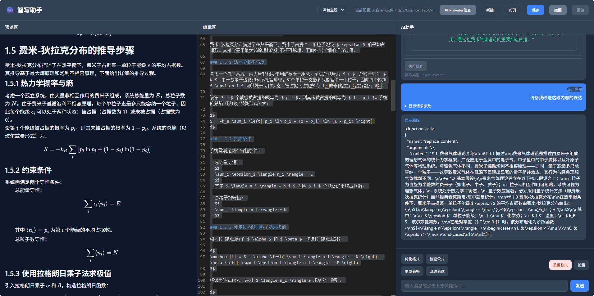
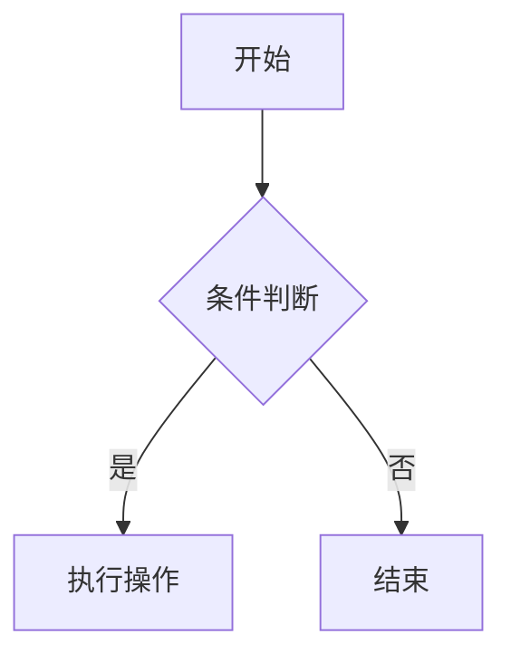

# MdMaker - AI智能Markdown编辑器

一个功能强大的AI辅助Markdown编辑器，专为技术写作和内容创作优化。支持实时预览、多种AI模型集成、LaTeX数学公式、代码高亮等高级功能。

> 🚀 **纯前端实现** - 无需后端支持，开箱即用  
> 🤖 **AI增强** - 集成DeepSeek、Kimi、LM Studio等多种AI模型  
> 🎯 **专业级编辑** - 支持LaTeX公式、代码高亮、表格等Markdown扩展语法

## 📋 目录

- [✨ 核心功能](#-核心功能)
- [🚀 快速开始](#-快速开始)
- [📖 使用指南](#-使用指南)
- [⚙️ 配置与部署](#️-配置与部署)
- [🛠️ 技术栈](#️-技术栈)
- [📁 项目结构](#-项目结构)
- [🤝 贡献指南](#-贡献指南)
- [📄 许可证](#-许可证)

## 🌟 核心功能

### 编辑体验
- **实时预览** - 所见即所得的Markdown编辑体验
- **多面板布局** - 支持编辑区、预览区、AI助手三栏智能布局
- **滚动同步** - 编辑器和预览区智能滚动同步，保持位置一致
- **快捷键支持** - 完整的键盘快捷键操作
- **撤销/重做** - 无限层级的编辑历史管理

### AI智能助手
- **智能写作** - AI辅助内容生成和优化
- **格式美化** - 自动优化Markdown格式和结构
- **LaTeX检查** - 智能识别和修复数学公式错误
- **表格生成** - 自然语言生成复杂表格
- **多模型支持** - DeepSeek、LM Studio等多种AI模型
- **@智能引用** - 创新的@语法，支持引用选区、光标位置、完整文档

### AI提供商支持
- **DeepSeek** - 支持深度思考和标准对话模式
- **LM Studio** - 本地AI模型部署，支持思考模式
- **可扩展架构** - 基于JSON配置的AI提供商管理，轻松添加新服务

### 文档管理
- **本地存储** - 自动保存编辑内容到浏览器缓存
- **文件导入** - 支持拖拽和点击导入Markdown文件
- **导出功能** - 一键导出标准Markdown格式
- **新建文档** - 快速创建空白文档或使用模板

### 视觉体验
- **主题系统** - 浅色、深色、护眼三种专业主题
- **代码高亮** - 支持150+编程语言的语法高亮
- **LaTeX渲染** - 基于KaTeX的数学公式完美渲染
- **响应式设计** - 完美适配桌面和移动设备

## 运行效果



## 🚀 快速开始

### 前置要求
确保您的开发环境满足以下要求：
- **Node.js** >= 16.0.0 (推荐使用最新的LTS版本)
- **npm** >= 8.0.0 或 **yarn** >= 1.22.0

### 安装步骤

#### 1. 获取项目代码
```bash
# 通过git克隆
git clone https://github.com/your-username/MdMaker.git
cd MdMaker

# 或直接下载ZIP包
# 解压后进入项目目录
cd MdMaker
```

#### 2. 安装依赖
```bash
# 使用npm
npm install

# 或使用yarn
yarn install

# 或使用pnpm
pnpm install
```

#### 3. 配置环境变量（可选）
创建 `.env` 文件配置AI服务：
```bash
# 复制示例文件（如果有的话）
cp .env.example .env

# 或手动创建
echo "VITE_AI_BASE_URL=https://api.deepseek.com" > .env
echo "VITE_AI_API_KEY=your-api-key-here" >> .env
```

#### 4. 启动开发服务器
```bash
# 仅启动前端开发服务器
npm run dev

# 前后端同时启动（推荐）
npm run dev:all

# 仅启动后端配置服务器
npm run dev:server
```

#### 5. 访问应用
- **本地开发环境**: http://localhost:5173
- **后端配置服务**: http://localhost:3001

### 构建命令速查
```bash
# 开发环境
npm run dev          # 启动Vite开发服务器
npm run dev:server   # 启动Express配置服务器
npm run dev:all      # 同时启动前后端

# 生产构建
npm run build        # 构建生产版本
npm run preview      # 预览构建结果
npm run build:all    # 构建并预览
```

### 验证安装
访问 http://localhost:5173 后，您应该能看到：
- ✅ 左侧Markdown编辑器
- ✅ 中间实时预览区域
- ✅ 右侧AI助手面板
- ✅ 顶部工具栏和主题切换器

## 📖 使用指南

### 基础操作

#### 创建和编辑文档
1. **新建文档** - 点击工具栏的 "🆕 新建" 按钮或按 `Ctrl/Cmd + N`
2. **编辑内容** - 在左侧编辑器中输入Markdown语法文本
3. **实时预览** - 中间面板实时显示渲染效果
4. **保存文档** - 点击 "💾 保存" 按钮或按 `Ctrl/Cmd + S`

#### 文件管理
- **打开文件** - 支持拖拽上传或点击 "📂 打开" 按钮
- **导入Markdown** - 支持 `.md`, `.markdown`, `.mdx` 格式
- **导出文档** - 一键导出为标准Markdown格式
- **自动保存** - 每30秒自动保存到浏览器缓存

### 🎨 界面布局

#### 三栏式布局
- **左侧** - Monaco编辑器（支持语法高亮、自动补全）
- **中间** - 实时预览（所见即所得）
- **右侧** - AI助手面板（智能交互）

#### 视图模式切换
- **编辑模式** - 专注写作，隐藏预览
- **预览模式** - 全屏预览，隐藏编辑器
- **分屏模式** - 编辑和预览并排显示（默认）

### 🤖 AI助手深度使用

#### 快速入门
1. **选择文本** - 在编辑器中选中需要处理的文本
2. **选择功能** - 从AI助手面板选择相应功能
3. **获取结果** - AI处理后自动替换或插入内容

#### 核心功能
| 功能 | 描述 | 示例 |
|------|------|------|
| **📝 内容优化** | 改进表达、修正语法 | 将口语化内容转为书面语 |
| **🎨 格式美化** | 统一Markdown格式 | 自动调整标题层级、列表缩进 |
| **📊 表格生成** | 自然语言创建表格 | "创建一个3列的产品对比表" |
| **🔍 公式检查** | 验证LaTeX语法 | 自动修复数学公式错误 |
| **💡 内容扩展** | 基于大纲生成内容 | 根据标题自动生成段落 |
| **🎯 智能引用** | @语法引用文档内容 | @selection 引用选中文本 |

#### @智能引用语法
在AI助手中输入 `@` 符号可快速引用文档内容：

| 语法 | 功能 | 说明 |
|------|------|------|
| `@selection` | 引用选中文本 | 自动包含选区内容和行号信息 |
| `@selection#L5` | 引用指定行 | 精确引用第5行内容 |
| `@selection#L3-7` | 引用行范围 | 引用第3到第7行的内容 |
| `@cursor` | 引用光标位置 | 引用光标周围100字符的上下文 |
| `@document` | 引用完整文档 | 引用整个文档内容（最多1000字符） |

**使用示例：**
```
请帮我优化这段文字的@selection
总结从@selection#L1到@selection#L10的要点
根据@document生成文章大纲
在@cursor位置添加一个过渡段落
```

**快捷键支持：**
- `↑` / `↓` - 在引用选项中导航
- `Enter` / `Tab` - 确认选择
- `Esc` - 取消菜单

#### 支持的AI模型
- **DeepSeek** - 国产大模型，支持深度思考和标准对话模式
  - 模型：`deepseek-chat`、`deepseek-reasoner`
  - 特点：代码能力强，支持联网搜索
- **LM Studio** - 本地部署，保护隐私
  - 模型：`qwen/qwen3-30b-a3b-2507`、`openai/gpt-oss-20b`
  - 特点：支持思考模式，完全本地化运行

#### 配置AI服务
1. **获取API Key** - 从对应平台申请
2. **配置环境变量** - 在设置界面输入API信息
3. **测试连接** - 点击"测试"按钮验证连接
4. **选择模型** - 从下拉列表选择具体模型

### 🎯 主题系统

#### 三种专业主题
- **浅色主题** - 清爽简洁，适合日间使用
- **深色主题** - 护眼省电，适合夜间编程
- **护眼主题** - 柔和绿色，长时间写作舒适

#### 快速切换
- **点击切换** - 顶部工具栏主题选择器
- **快捷键** - `Ctrl/Cmd + /` 循环切换主题
- **自动切换** - 根据系统主题自动适配

### 🛠️ 高级功能

#### 数学公式编辑
```markdown
# 行内公式
爱因斯坦质能方程：$E=mc^2$

# 块级公式
$$\int_{-\infty}^{\infty} e^{-x^2} dx = \sqrt{\pi}$$
```

#### 代码高亮
```javascript
// 支持150+编程语言
function fibonacci(n) {
  if (n <= 1) return n;
  return fibonacci(n-1) + fibonacci(n-2);
}
```

#### Mermaid图表


### 📱 移动端支持
- **响应式设计** - 完美适配手机和平板
- **触摸优化** - 支持手势操作
- **离线使用** - 安装为PWA应用

## ⚙️ 配置与部署

### 环境变量
| 变量名 | 说明 | 示例 |
|--------|------|------|
| `VITE_AI_BASE_URL` | AI服务地址 | `https://api.deepseek.com` |
| `VITE_AI_API_KEY` | API密钥 | `sk-xxx...` |
| `VITE_AI_MODEL` | 模型名称 | `deepseek-chat` |

### 部署方式
| 方式 | 命令 | 平台 |
|------|------|------|
| **静态托管** | `npm run build` → 上传 `dist/` | Vercel, Netlify |
| **Docker** | `docker build -t mdmaker .` | 任意支持Docker的平台 |
| **本地预览** | `npm run preview` | 本地测试 |

## 🛠️ 技术栈

### 核心技术
| 类别 | 技术 | 用途 |
|------|------|------|
| **前端** | React 18 + TypeScript 5 | 现代化UI开发 |
| **构建** | Vite 4 | 极速构建和热更新 |
| **样式** | Tailwind CSS 3 | 响应式界面设计 |
| **编辑器** | Monaco Editor | VS Code同款编辑体验 |
| **解析** | Marked 16 | Markdown转HTML |
| **数学** | KaTeX 0.16 | LaTeX公式渲染 |
| **后端** | Express 5 | 配置管理服务器 |

### 项目结构
```
MdMaker/
├── src/                          # 核心源码
│   ├── App.tsx                  # 主应用组件和状态管理
│   ├── main.tsx                 # React应用入口
│   ├── MessageItem.tsx          # AI对话消息组件
│   ├── TreeDemo.tsx            # 树形数据可视化演示
│   ├── TreeRenderer.tsx        # 树形结构渲染器
│   ├── AtSuggestionsMenu.tsx   # @语法建议菜单组件
│   ├── useAtSyntax.ts          # @语法交互Hook
│   ├── AtSyntaxParser.ts       # @语法解析工具
│   ├── promptTemplates.ts      # AI提示词模板
│   ├── ai-providers.json       # AI提供商配置
│   └── index.css               # 全局样式
├── public/                       # 静态资源
│   └── logo.svg                # 应用图标
├── server.js                   # Express配置服务器
├── package.json                # 项目依赖配置
├── vite.config.ts              # Vite构建配置
├── tailwind.config.js          # Tailwind CSS配置
└── tsconfig.json               # TypeScript配置
```

### 核心模块说明
- **AtSuggestionsMenu.tsx** - 浮动菜单组件，提供@语法选项
- **useAtSyntax.ts** - React Hook，管理@语法的所有交互逻辑
- **AtSyntaxParser.ts** - 解析和替换@标记的工具函数
- **ai-providers.json** - 可扩展的AI提供商配置文件


## 🤝 贡献指南

欢迎贡献！Fork → 修改 → Pull Request

## 📄 许可证

Apache 2.0 License - 详见 [LICENSE](LICENSE)
