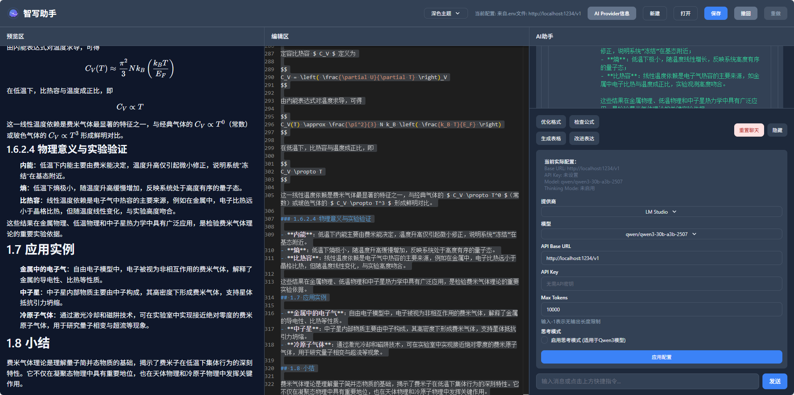

# 智写助手

一个简洁的AI辅助Markdown编辑器，纯前端实现，无需后端支持。支持多种AI模型，包括DeepSeek、Kimi和LM Studio等。

## 功能特点

- ✨ 实时Markdown编辑与预览
- 👀 预览模式切换（编辑区、预览区、AI助手三栏布局）
- 💾 保存为Markdown文件
- 📂 打开现有Markdown文件
- 🆕 新建文档
- 🎨 美观的界面设计（支持浅色、深色、护眼三种主题）
- 🤖 AI助手集成（支持多种AI模型）
- 🔧 撤销/重做功能
- 📋 代码高亮与LaTeX公式支持

## 运行效果


## 快速开始

### 安装依赖
```bash
npm install
```

### 启动开发服务器
```bash
npm run dev
```

### 构建生产版本
```bash
npm run build
```

### 预览构建结果
```bash
npm run preview
```

## 使用方法

1. 启动应用后，直接在编辑框中输入Markdown文本
2. 点击"Preview"按钮查看渲染效果
3. 点击"Save"按钮将文档保存为.md文件
4. 点击"Open"按钮打开现有的Markdown文件
5. 点击"New"按钮创建新文档

### AI助手功能

AI助手集成在右侧面板，支持多种操作：
- 优化Markdown格式
- 检查LaTeX公式
- 生成表格
- 改进内容表达
- 自定义提示词交互

AI助手支持多种模型配置：
- DeepSeek（需要API Key）
- Kimi（需要API Key）
- LM Studio（本地模型，无需API Key）
- 自定义模型（可配置Base URL和API Key）

### 设置界面



### 主题功能

应用支持三种主题模式，可通过顶部工具栏的主题选择器切换：
- 浅色主题（默认）
- 深色主题
- 护眼主题

### AI Provider信息查看

点击顶部的"AI Provider信息"按钮，可以查看当前支持的AI提供商及其配置信息。

## 环境变量配置

应用支持通过环境变量配置AI模型参数，可以通过以下方式配置：

1. 在项目根目录创建 `.env` 文件
2. 设置以下环境变量：
   ```
   VITE_AI_BASE_URL=AI服务的基础URL
   VITE_AI_API_KEY=API密钥（部分提供商需要）
   VITE_AI_MODEL=使用的模型名称
   VITE_AI_THINKING_MODE=true/false（是否启用思考模式）
   VITE_AI_MAX_TOKENS=最大token数量
   ```

3. 重启开发服务器使配置生效

## 后端服务器

应用包含一个简单的后端服务器，用于保存环境变量配置到 `.env` 文件。

### 启动后端服务器

```bash
npm run dev:server
```

### 同时启动前后端

```bash
npm run dev:all
```

## 构建与部署

### 构建生产版本

```bash
npm run build
```

### 预览生产版本

```bash
npm run preview
```

### 构建并预览

```bash
npm run build:all
```

构建后的文件位于 `dist` 目录，可直接部署到静态文件服务器。

## 技术栈

- React 18：用于构建用户界面的JavaScript库
- TypeScript：为JavaScript添加静态类型定义
- Tailwind CSS：用于快速构建自定义用户界面的CSS框架
- Vite：下一代前端构建工具，提供快速的开发体验
- Monaco Editor：VS Code的代码编辑器组件，提供强大的编辑功能
- Marked：Markdown解析器，用于将Markdown转换为HTML
- KaTeX：快速的数学排版库，用于渲染LaTeX公式
- Express：Node.js的Web应用框架，用于后端服务器

## 项目结构

```
├── src/                          # 源代码目录
│   ├── App.tsx                  # 主应用组件
│   ├── main.tsx                 # 应用入口
│   ├── index.css                # 全局样式文件
│   ├── MessageItem.tsx          # 消息项组件
│   ├── TreeDemo.tsx             # 树形结构演示组件
│   ├── TreeRenderer.tsx         # 树形渲染组件
│   ├── vite-env.d.ts            # Vite环境类型定义
│   └── ai-providers.json        # AI提供商配置
├── public/                      # 公共资源目录
│   └── logo.svg                 # 应用图标
├── index.html                   # HTML模板
├── package.json                 # 项目配置
├── package-lock.json            # 依赖锁定文件
├── vite.config.ts               # Vite配置
├── tsconfig.json                # TypeScript配置
├── tsconfig.node.json           # Node.js TypeScript配置
├── tailwind.config.js           # Tailwind配置
├── postcss.config.js            # PostCSS配置
├── server.js                    # Express后端服务器
├── .gitignore                   # Git忽略文件
├── LICENSE                      # 许可证文件
├── README.md                    # 项目说明文档
├── demo.png                     # 运行效果截图
└── demo2.png                    # 设置界面截图
```

## 许可证

Apache License
